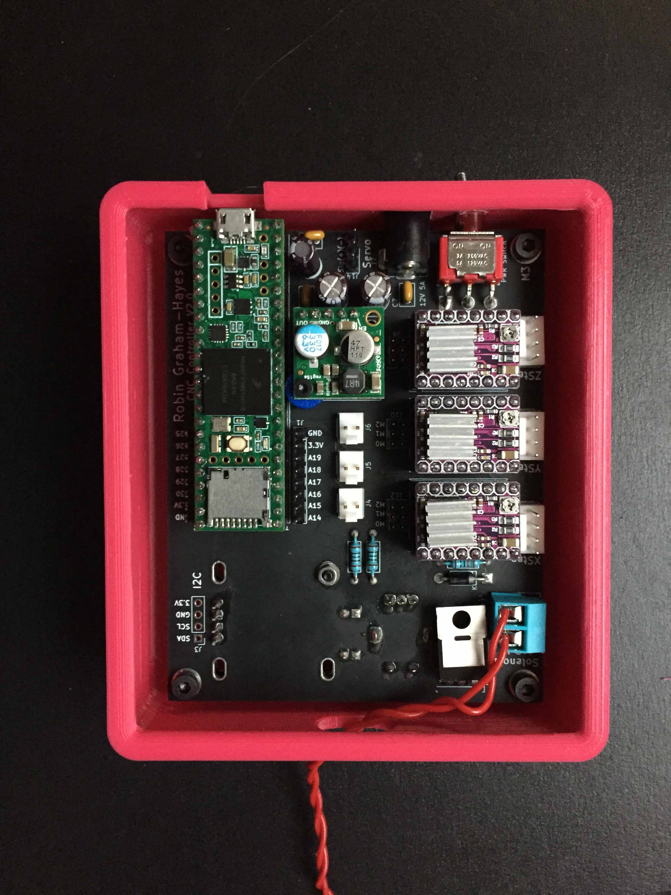
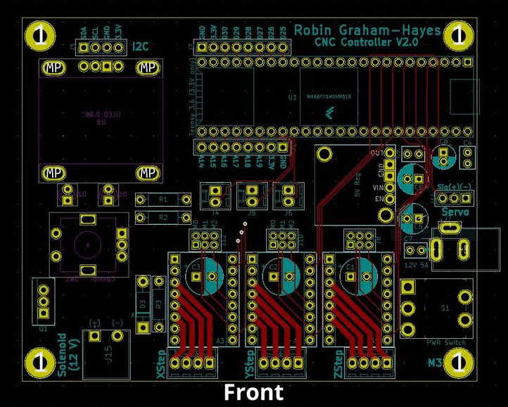

# CNC Control Board

## Description

I designed and built a CNC control board that can be used for a variety of projects. It can be used to control a robotic arm, CNC router, plotter, or even for [DotBot](http://poe.olin.edu/2019/dotbot/), my POE project. It has the ability to connect to a computer or access files from a microSD card in order to receive instructions.  My plan is to later implement this into 

## Demo

*A demonstration of the menu system.*
 [here](https://youtu.be/DLJNf7T_Ems).

*A demonstration of basic board abilities.*
*Check out the full video* [here](https://youtu.be/oVZTHuJGgR0).

## Specs

The board is controlled by a Teensy 3.6 microcontroller to provide the many ports needed, fast processing, and even an microSD slot to import data, like Gcode. and has the following components:

### Actuators

- Three Steppers
- A Servo
- A 12V device (Solenoid, DC Motor, Extruder Hotend)

### User Interface

- 64x128 OLED Display
- Rotary Encoder with switch
- Green and Red LEDs

### Control

- Three connectors for limit switches
- Six Analog/Digital pins
- Six Digital pins
- I2c Connection
- Jumpers to control micro stepping

### Power

- Hardwired toggle switch to disconnect all power
- Barrel Jack for 12V 5A source

## Micro Stepping

|  M0  |  M1  |  M2  | Microstep Resolution |
| :--: | :--: | :--: | :------------------: |
| Low  | Low  | Low  |      Full step       |
| High | Low  | Low  |       1/2 step       |
| Low  | High | Low  |       1/4 step       |
| High | High | Low  |       1/8 step       |
| Low  | Low  | High |      1/16 step       |
| High | Low  | High |      1/32 step       |
| Low  | High | High |      1/32 step       |
| High | High | High |      1/32 step       |

## The Board

Check out the [schematic](/CNC_Schematic.pdf) for version 2.0!

*Layers of the PCB*

## Reflection

I really enjoyed working on this project and learned a lot! I had never designed a PCB before and leaning the basics PCB design in by making something I can use for tons of other projects is really exciting! 

## Future Steps

If I were to make another iteration I would switch to using surface mount components to save space and cost. I would also add another stepper to make it easier to hook up the board to a 3d printer. I would also rewire to allow other stepper drivers like the TMC2209 to be swapped in.

Since this Board contains everything to run the [DotBot](http://poe.olin.edu/2019/dotbot/), one of my next steps is to attach the gantry I designed.

## Want to use this board?

All of the materials are available on [Github](https://github.com/robingh42/CNC_Control_Board)

- Gerbers for ordering the PCB
- Basic Arduino code to show off the boards features
- STL for 3d printing Case
- Check out the [Bill of materials](./CNC_Board_BOM.md)