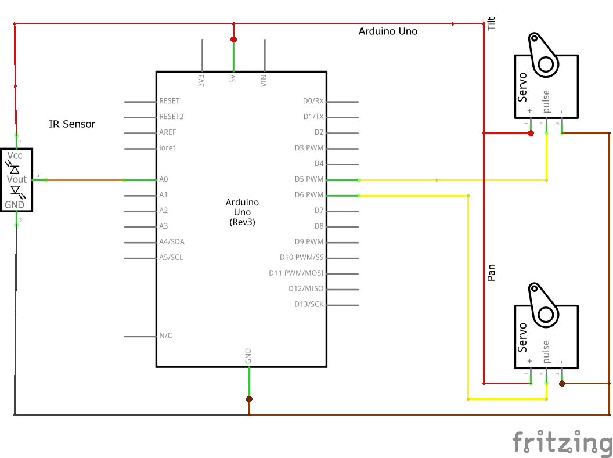
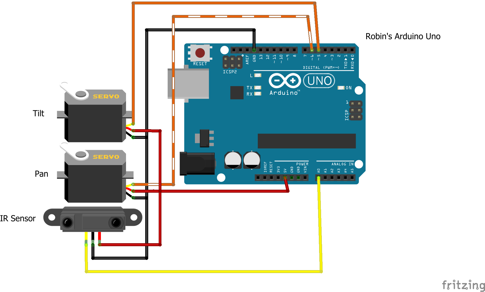
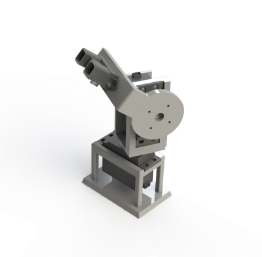
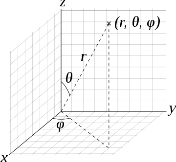
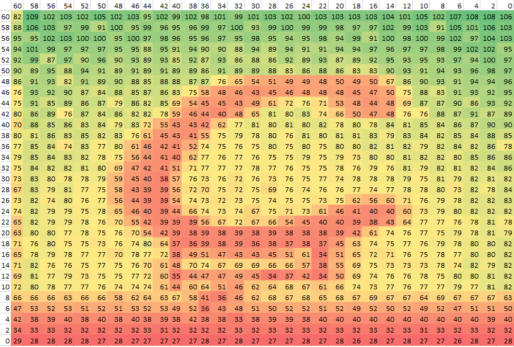
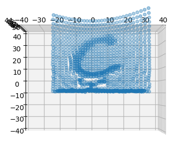
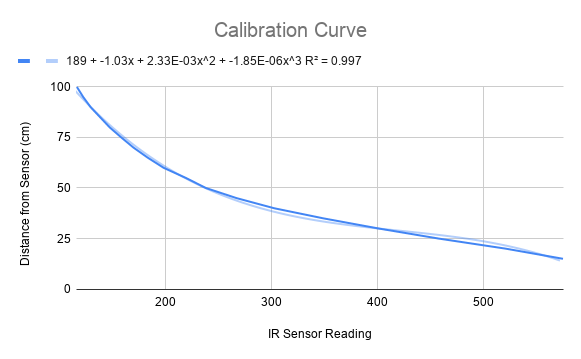

# Infrared Scanner
In colaboration with Shirin Kuppusamy

## Introduction

The purpose of this lab is to get familiar with actuators and sensors in a micro controller environment as well as to develop an understanding of ways to display that data. To do this we created a 3D scanner using two servo motors as a pan-tilt mechanism and an IR sensor to measure distance. The goal is to read in the angles of the servo motors and map the IR sensor values to distances that can then be stored and plotted to visualize a letter of the alphabet in 3D. Through this we can learn about creating physical systems, controlling them, and reading data to make computer models of the real world.
    
## Creating the Setup
### The circuit

The circuit for this was fairly simple as seen in Figure \ref{fig:bb}. We connected all the $V_{in}$'s to the arduino's $5V$ source and all the grounds to the arduino's ground. We then connected the "tilt" servo to digital pin 5 and pan to pin 6. We attached the IR sensor to analog pin A0.

### The Pan-Tilt Apparatus

I created the apparatus to keep the sensor level, panning about the z axis, and tilting in a sphere with a known radius. I decided to leave a radius (5.66 cm) to keep the mechanism balanced while maintaining design and simplicity for the 3D printer and assembly. The grey frame is 3D printed PLA, and then I assembled everything with machine screws.

## Collecting the Data

We first used the Servo class to attach the servos to the pins and set up the needed variables. In order to store the data as it was being collected and then later manipulate the data to plot it, we used python as the back-end software by using pyserial. To signal the arduino to start collecting data only when we ran the python program, we used a loop that checks whether the serial is available and flushes it based on a message that the python program writes to the serial when we run it (lines 36-40).

Once the serial begins, the servo pans through a range at each tilt angle. At each angle, the servo reads in an IR value from 0 to 1023 that is then mapped to a distance value using our calibration curve (line 75). The creation of our calibration curve is discussed further in Section 5. We then print the distance, pan angle, and tilt angle to the serial, thus allowing the python back-end to read in and decode each line of data.

As each line is read in by the python program, the values are appended to 3 arrays consisting of distances, pan angles, and tilt angles respectively (see line 75-77). These arrays are then converted from the Spherical r, theta, and phi arrays to new 2 new arrays consisting of Cartesian x, y, z coordinates that are then plotted using matplotlib. 
    

To convert from spherical coordinates we find the parameters $(r,\theta, \varphi)$ from the arduino's output and map them to the variables $(X,Y,Z)$. In this case r is the distance sensed plus the radius of the sphere that the sensor moved about ($r_{total}=r_{sensor}+5.66$); $\theta$ is the angle of the tilt servo measured from the axis that the pan servo turns about (perpendicular to the surface of the floor); and $\varphi$ is the angle parallel to the letter and long side of the pan-tilt base. For $\theta$ and $\varphi$, we had to convert the values being read in by the arduino from the frame of reference of the IR sensor to a standard mathematical/physical frame of reference based on an origin at (0,0,0). 

Then using basic trigonometry:
$$ X= r_{total}*Sin(\theta)*Cos(\varphi)$$
$$ Y= r_{total}*Sin(\theta)*Sin(\varphi)$$
$$ Z= r_{total}*Cos(\theta)$$
You can see our calibration to get from the servo's built in angles to the angles described above in the output statements of the arduino code.
\newpage

## Data
### Test Data  

### Final Data

        
\newpage

## Sensor Calibration
To set up our calibration we set the sensor in a stand that kept it horizontal and the front perpendicular to the measuring tape that was set 2-3 inches below the stand. After setting up the measuring tape and stand, we created an arduino code to read the analog data, take a average every ten values, and print it to the serial monitor.

We then took a 18"x24" pine plywood sheet 1/8" thick and held it vertically at 20 cm away from the sensor, and wrote down the printed average from the serial monitor in excel. We then took readings every 5 cm to 1 m, and then ran another 20 cm to 1 m trial. Taking these data sets, we took the average of each value at a set distance, and created a cubic line of best fit to get distances from the analog out values. $$distance = 189 - 1.03x + 0.00233x^2 - 0.00000185x^3$$ We then tested the distance values by outputting the calculated distance in the serial monitor and verifying that it was correct to an error of $\pm$ 3 cm. These values do not include the 5.66 cm to the center of rotation, as that is only needed later for converting to Cartesian coordinates. Figure 7 displays our calibration curve. 

## What We learned
In the programming side of the things, the biggest challenge was communicating effectively from the arduino to the python. We encountered some errors because the python would start reading mid process if the arduino was already recording data. Thus, we learned about how to write to the serial from python and check the serial's availability before proceeding to recording data. On the python side of things, another main learning point was finding out how to catch the loop's end, and exit the python loop to carry out manipulation and plotting of the data. We used a try...except statement to debug this error. 
We also learned about calibrating data output to fit mathematical models both from calibrating the sensor and by converting the Spherical coordinates to Cartesian (taking into account the 5.66 cm sphere the sensor moves in). 

## Conclusion

Overall, the lab yielded a successful result, and the scanner did display a clear visualization of the letter. However, we needed to modify the boundaries of the graph to account for the data only in the range that we care about, and we had to test various positions of the letter (flat against a wall, at a small distance from a wall, and at a large distance from a wall) until we found a position that yielded the clearest scan with the least extraneous data. The scanning/plotting mechanism does display a lot of noise, possibly from edges of the letter. We hypothesize that this noise is due to other objects and imperfect positioning. However, although not perfect, for the purpose of our lab, we had a result that accomplished the desired goals in an efficient manner. 

