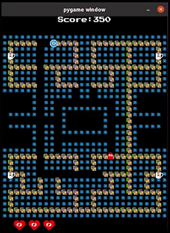

# OlinMan: The Video Game

## Description

As a final project for my [Software Design](https://olin.smartcatalogiq.com/2020-21/Catalog/Courses-Credits-Hours/ENGR-Engineering/2000/ENGR2510)class, I created *OlinMan: The Video Game* using [pygame](https://www.pygame.org/news) and a Model-View-Controller architecture. As OlinMan your goal is to collect as many Post-It notes, coins, and Acronym coffees before the ghosts catch you.

## Artwork
Besides writing all the code, and architecture design this project required a lot of pixel art to create the sprites you'll see in the game. Below are the assets I created for use in the game.

## Features

### Start Menu

### Side Passage

### Pause Screen

### New Level Creation

### Death Screens

### Directional Bouncing

OlinMan bounces or squeezes based on the direction he moves!

## Reflection
This was a really interesting project to complete. I ended up learning a lot through modifying classes and debuging. Writing unit tests for complex or visual code is difficult but can be very rewarding!

## Future Steps
In the future I'd like to imporve a few things. I want to make it so that after drinking the coffee, you can eat the ghosts and score points. I also wanna add more ghosts, changes in speed, and different stages depending on the level. As a final step I think the game should be compiled into an easily executable file like a .exe so more people can try playing it!

## Want to play the game?

All of the materials are available on [Github](https://github.com/robingh42/OlinMan) including download instructions.